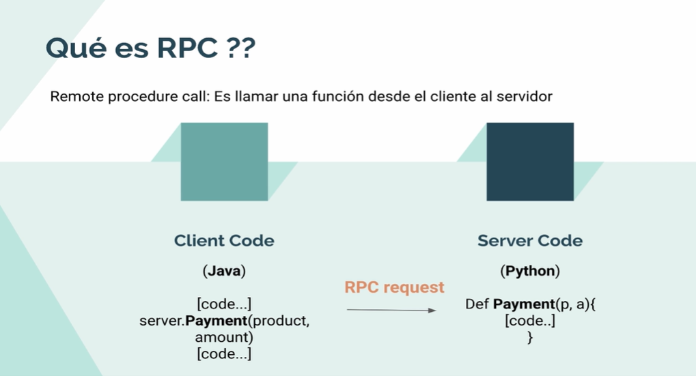

# RPC:

Remote procedure call: es llamar una función desde el cliente al servidor.


## ¿Qué son los buffers de protocolo?

Los buffers de protocolo son el mecanismo extensible, neutral en cuanto al lenguaje y la plataforma de Google para
serializar datos estructurados; piense en XML, pero más pequeño, más rápido y más simple. Usted define cómo desea que se
estructuren sus datos una vez, luego puede usar un código fuente especial generado para escribir y leer fácilmente sus
datos estructurados hacia y desde una variedad de flujos de datos y utilizando una variedad de lenguajes.
[Protocol Buffers](https://protobuf.dev/)


## export 
# c++
```shell
protoc --cpp_out ./cpp *.proto
```

# java
```shell
protoc --java_out ./java *.proto
```
# go
```shell
protoc --java_out ./java *.proto
```